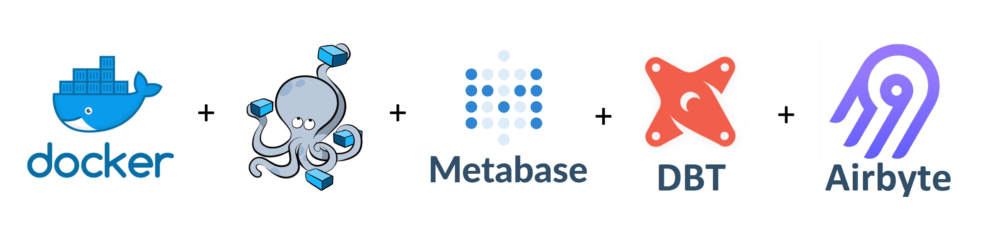

# DataPlatform on Docker Compose

  

# About
A complete Open Source Data Platform with ETL, DataWarehouse and DataViz

# Prerequisites
- Docker (started) and docker-compose (just install Docker for Desktop if you are on laptop) 

# Quickstart
1. Clone repo `git clone https://github.com/datafuel/DataPlatform_docker.git`
2. Run `cd DataPlatform_docker`
3. Rename **.env.example** to **.env** and replace dummy values with yours
4. Run `docker-compose up` then access the services

Make sure to wait at least 30 seconds before launching any service ! 

## Access services
  - Metabase : http://localhost:3000
  - Airbyte : http://localhost:8000
  - dbt docs : http://localhost:4444 (after running the instructions described below)

## Demo with Covid data

1. Run `docker-compose up`
2. Wait until all services are ready then open http://localhost:8000
3. Create a **File** source with the values below (you can input the values of your choice for other fields) 
    - **url** : https://www.data.gouv.fr/fr/datasets/r/63352e38-d353-4b54-bfd1-f1b3ee1cabd7
    - **format** : csv (and HTTPS: Public Web in the field below)
    - **storage** : HTTPS
    - **dataset_name** : covid-france
    - **reader_options** : `{"quotechar":"\"", "sep":";"}`

4. Create a **Postgres** destination with the values below (you can input the values of your choice for other fields)
    - **host** : localhost
    - **Port** : 5433
    - **schema** : stg
    - **database** : testdb
    - **password** : <your-database-password> (DWH_POSTGRES_PASSWORD in .env)
    - **username** : <your-database-username> (DWH_POSTGRES_USERNAME in .env)

5. Create another **File** source connector with the following arguments :
    - **url** : https://www.data.gouv.fr/fr/datasets/r/70cef74f-70b1-495a-8500-c089229c0254
    - **format** : csv (and HTTPS: Public Web in the field below)
    - **storage** : HTTPS
    - **dataset_name** : departements-france
    - **reader_options** : *Leave empty*
### Run Metabase Configurator

1. Run `docker exec dbt python metabase_setup.py`

### Run dbt

1. Run `docker exec -d dbt bash startup.sh`

    You can then access the docs website on http://localhost:4444

## Projects that we used

This project use [dbt-metabase](https://github.com/gouline/dbt-metabase). [gouline](https://github.com/gouline) is the owner of the code used in /metabt (except Admin Class that was part of the metabase_configurator service).

